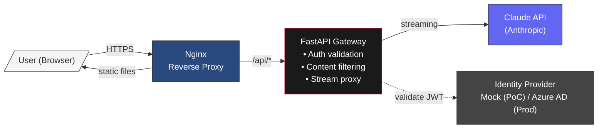
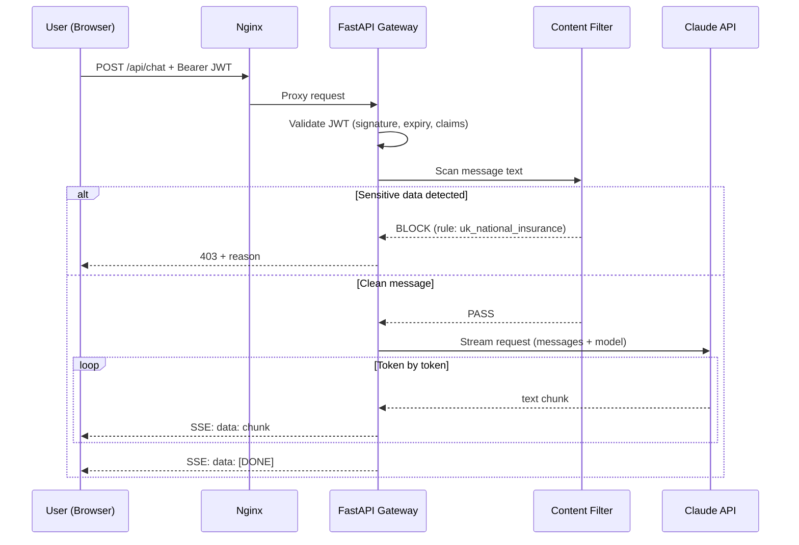
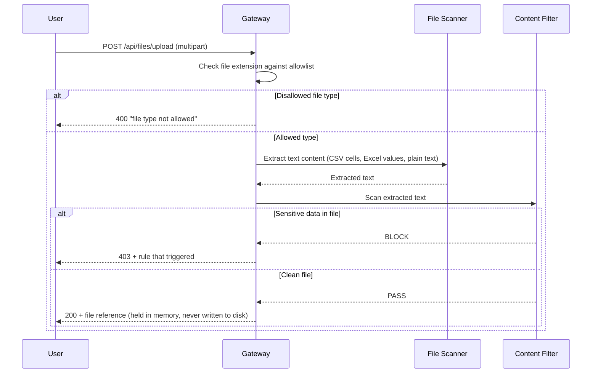
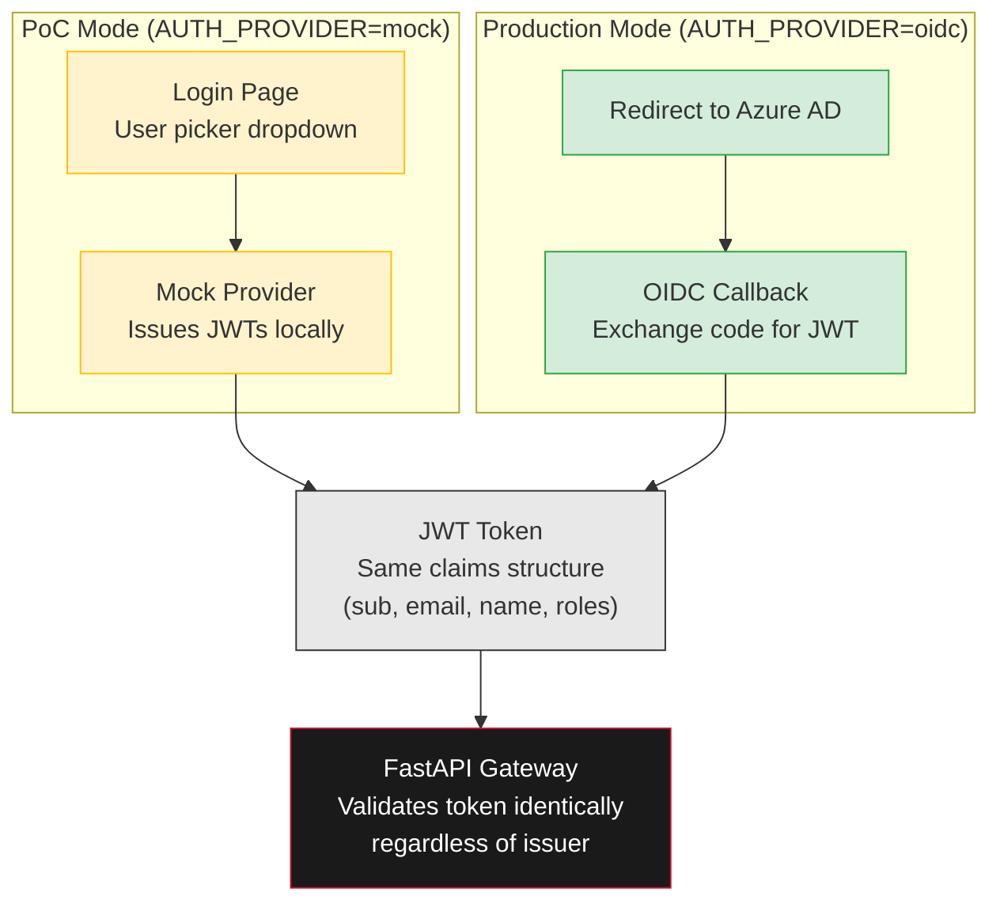
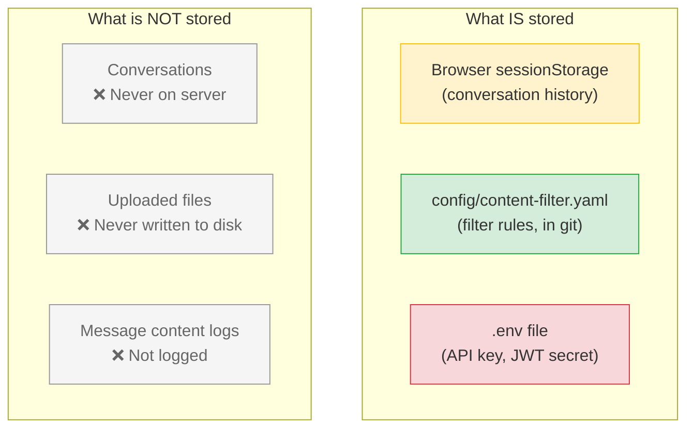
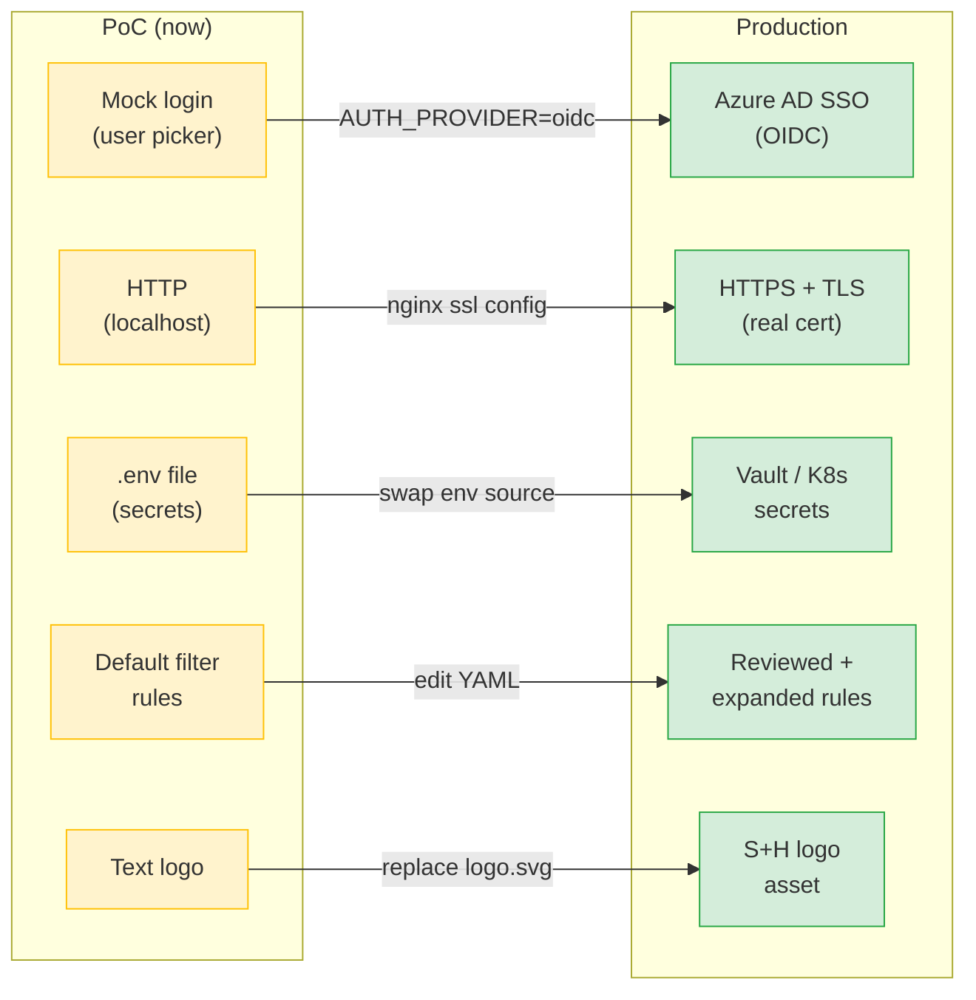

# Smith+Howard Chat

Enterprise AI chat gateway powered by Claude. Gives accounting, tax, and advisory teams a familiar ChatGPT-like experience with built-in content filtering for sensitive financial data.

> **Status:** Proof of Concept — designed for easy upgrade to production. See [Going to Production](#going-to-production).

---

## How It Works



**Three containers, no database.** The FastAPI gateway sits between the user and Claude — it validates authentication, scans messages for sensitive data, and streams responses back. Conversations live only in the browser's `sessionStorage` and are never stored server-side.

---

## Request Flow

Every message goes through this pipeline before reaching Claude:



### File Upload Flow

Files follow an extra scanning step:



---

## Authentication

The auth system has one interface with two backends, swapped by environment variable:



**No code changes to switch** — only environment configuration. The JWT claims are identical in both modes, so the gateway validates them the same way.

---

## Content Filter

Server-side filtering scans every message and file before it reaches Claude. Rules are configured in `config/content-filter.yaml` — no code changes needed.

| What it detects | How | Action |
|---|---|---|
| UK National Insurance numbers | Regex pattern matching | **Block** + tell user why |
| Credit/debit card numbers | Luhn algorithm validation | **Block** + tell user why |
| UK bank account numbers | Sort code + account pattern | **Block** + tell user why |
| Email addresses | Standard email regex | **Warn** (allow with notice) |
| Disallowed file types | Extension allowlist | **Block** upload |

**File scanning** goes deeper than filenames — CSV cells and Excel cell values are extracted and scanned individually.

### Adding a new rule

Edit `config/content-filter.yaml`:

```yaml
rules:
  # ... existing rules ...
  
  - name: phone_number
    pattern: '(\+44|0)\d{10,11}'
    action: block
    message: "Message blocked: contains what appears to be a UK phone number"
```

Restart the backend container to pick up changes.

---

## Quick Start

### Prerequisites

- Docker and Docker Compose
- An Anthropic API key ([console.anthropic.com](https://console.anthropic.com))

### Setup

```bash
git clone https://code.roche.com/ai-uk/chatgateway.git
cd chatgateway
cp .env.example .env
# Edit .env — add your ANTHROPIC_API_KEY
docker compose up --build
```

Open **http://localhost**, select a mock user, start chatting.

### Development (without Docker)

**Backend:**
```bash
cd backend
python3 -m venv .venv && source .venv/bin/activate
pip install -r requirements.txt
cp ../.env.example ../.env  # edit with your API key
uvicorn main:app --reload --port 8000
```

**Frontend:**
```bash
cd frontend
npm install
npm run dev
```

Vite proxies `/api/*` to `localhost:8000` automatically.

### Running Tests

```bash
cd backend
python3 -m pytest tests/ -v
```

51 tests covering: auth (unit + integration), content filter (regex, Luhn, file scanners), API routes (chat, files, health), and regression edge cases.

---

## API Reference

| Endpoint | Method | Auth | Description |
|---|---|---|---|
| `/api/health` | GET | No | Health check — returns `{"status": "ok"}` |
| `/api/auth/users` | GET | No | List available mock users (PoC only) |
| `/api/auth/login` | POST | No | Mock login — returns JWT. Body: `{"username": "john.doe"}` |
| `/api/chat` | POST | Yes | Send message to Claude (streaming SSE response). Body: `{"messages": [...]}` |
| `/api/files/upload` | POST | Yes | Upload file for scanning. Multipart form with `file` field |

### Chat request example

```bash
# Get a token
TOKEN=$(curl -s -X POST http://localhost/api/auth/login \
  -H "Content-Type: application/json" \
  -d '{"username":"john.doe"}' | jq -r '.token')

# Send a message (streaming)
curl -N http://localhost/api/chat \
  -H "Authorization: Bearer $TOKEN" \
  -H "Content-Type: application/json" \
  -d '{"messages":[{"role":"user","content":"Summarise UK tax obligations for Q3"}]}'
```

### Content filter error response

```json
{
  "detail": {
    "error": "content_filtered",
    "message": "Message blocked: contains what appears to be a National Insurance number",
    "rule": "uk_national_insurance"
  }
}
```

---

## Security Model



- **No server-side conversation storage** — sessionStorage only (cleared when tab closes)
- **Files scanned in memory, relayed to Claude, never written to disk**
- **JWT authentication** on every API request
- **Content filter is server-side** — cannot be bypassed from the browser
- **CORS restricted** to the frontend origin

---

## Going to Production

See [docs/production-guide.md](docs/production-guide.md) for step-by-step instructions.



### Quick reference

| Area | PoC | Production | How to switch |
|------|-----|-----------|---------------|
| **Auth** | Mock user picker | Azure AD / Entra OIDC | `AUTH_PROVIDER=oidc` + OIDC env vars |
| **TLS** | HTTP on localhost | HTTPS with real cert | Nginx ssl config + cert mount |
| **API Key** | Dev Claude key | Production key | `ANTHROPIC_API_KEY` env var |
| **Content filter** | Default rules | Reviewed/expanded | Edit `config/content-filter.yaml` |
| **Domain** | localhost | chat.smithhoward.com | Nginx `server_name` + DNS |
| **Secrets** | `.env` file | Vault / K8s secrets | Swap env var source |
| **Logo** | Text mark | S+H logo asset | Replace in `frontend/public/` |

---

## Project Structure

```
chatgateway/
├── .gitlab-ci.yml              # CI pipeline (tests, build, Docker)
├── docker-compose.yml          # Container orchestration
├── .env.example                # Environment variable template
│
├── config/
│   └── content-filter.yaml     # Content filter rules (YAML)
│
├── backend/                    # Python / FastAPI
│   ├── main.py                 # App entry point
│   ├── config.py               # Settings (pydantic-settings)
│   ├── auth/
│   │   ├── provider.py         # Auth provider protocol
│   │   ├── mock_provider.py    # Mock IdP (PoC)
│   │   └── middleware.py       # JWT validation
│   ├── filter/
│   │   ├── engine.py           # Content filter (scan text)
│   │   ├── rules.py            # YAML rule loader
│   │   ├── luhn.py             # Luhn algorithm (card detection)
│   │   └── scanners.py         # CSV/Excel text extraction
│   ├── proxy/
│   │   └── claude.py           # Claude API streaming proxy
│   ├── routes/
│   │   ├── auth.py             # /api/auth/* endpoints
│   │   ├── chat.py             # /api/chat endpoint
│   │   ├── files.py            # /api/files/upload endpoint
│   │   └── health.py           # /api/health endpoint
│   └── tests/                  # 51 tests (pytest)
│
├── frontend/                   # React 18 / TypeScript / Vite
│   └── src/
│       ├── App.tsx             # Root component (login vs chat)
│       ├── components/
│       │   ├── Header.tsx      # S+H branded header
│       │   ├── LoginPage.tsx   # Mock login page
│       │   ├── ChatWindow.tsx  # Message list + auto-scroll
│       │   ├── MessageBubble.tsx # Markdown rendering
│       │   ├── InputBar.tsx    # Text input + file attach
│       │   └── FilterToast.tsx # Content filter warning
│       ├── hooks/
│       │   ├── useAuth.ts      # Token management
│       │   └── useChat.ts      # Streaming + sessionStorage
│       └── services/
│           └── api.ts          # API client (fetch + SSE)
│
├── nginx/
│   └── nginx.conf              # Reverse proxy configuration
│
└── docs/
    └── production-guide.md     # PoC-to-production checklist
```

---

## CI/CD

GitLab CI runs on every push and merge request:

| Stage | Job | What it does |
|---|---|---|
| **test** | `backend-unit-tests` | Runs 51 pytest tests (auth, filter, routes, regression) |
| **test** | `frontend-typecheck` | TypeScript type checking (`tsc --noEmit`) |
| **build** | `frontend-build` | Vite production build |
| **docker** | `docker-build` | Validates Dockerfiles build (main + MRs only) |

---

## Tech Stack

| Layer | Technology |
|---|---|
| Backend | Python 3.12, FastAPI, uvicorn |
| Frontend | React 18, TypeScript, Vite |
| LLM | Anthropic Claude API (streaming) |
| Auth (PoC) | PyJWT, mock IdP |
| Auth (prod) | Azure AD OIDC |
| Content filter | Regex, Luhn algorithm, PyYAML, openpyxl |
| Markdown | react-markdown |
| Reverse proxy | Nginx |
| Containers | Docker, Docker Compose |
| CI | GitLab CI |
